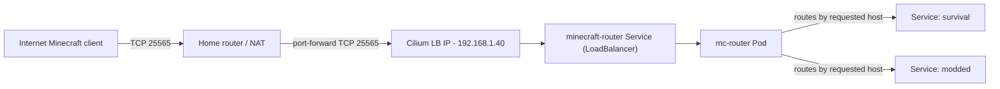
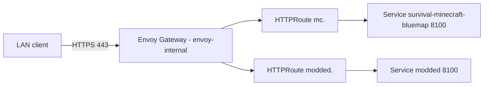

# Minecraft on Kubernetes (Talos + Flux + Cilium + Envoy Gateway)

This repo runs multiple Minecraft servers in the `minecraft` namespace using GitOps (Flux) and Cilium L2 LoadBalancers.

## High-level architecture

- **Game traffic (TCP 25565)**: handled by **`minecraft-router`** (`ghcr.io/itzg/mc-router`)
  - Exposed as a **Cilium `LoadBalancer`** on a fixed LAN IP
  - Routes players to backend servers based on the requested hostname (SRV / SNI-style routing)
- **Minecraft servers**:
  - **`survival`**: itzg Minecraft chart (`itzg/minecraft-server-charts`)
  - **`modded`**: deployed via `bjw-s/app-template` chart running `ghcr.io/itzg/minecraft-server`
- **Web UIs (BlueMap)**: exposed via **Gateway API `HTTPRoute`** through Envoy Gateway
  - Default in this repo: **internal-only** (uses `envoy-internal` in the `network` namespace)
- **Backups**: Volsync component is enabled for Minecraft apps (PVC + ReplicationSource/Destination pattern)
- **Secrets**: External Secrets Operator pulls from 1Password (no raw Secrets committed)

## Diagrams

### Game traffic (internet → LAN → mc-router → backends)



Notes:

- The cluster provides the **LAN entrypoint** (`192.168.1.40:25565`). Public access is achieved by **router port-forwarding**.
- The router API (8080) is **not required** for game traffic.

### Web UIs (BlueMap) (LAN → Envoy Gateway → HTTPRoute → service)



## Network / IPs

### Cilium LB IP pool

The cluster advertises `LoadBalancer` IPs on the LAN using Cilium L2:

- Cilium pool: `192.168.1.0/24` (see `kubernetes/apps/kube-system/cilium/app/networks.yaml`)

### Reserved IPs used by Minecraft

- **`minecraft-router`** (game entrypoint): `192.168.1.40`
- **`survival` RCON** (optional, LAN-only): `192.168.1.41`

Notes:

- These are allocated via Cilium LB IPAM annotations (`lbipam.cilium.io/ips`).
- “Free” in Kubernetes does not guarantee “free” on your LAN; keep these outside your router’s DHCP pool.

## DNS / hostnames

This repo avoids committing real domains. Hostnames use `${SECRET_DOMAIN}`, which is provided via Flux substitutions from `cluster-secrets`.

Examples:

- `minecraft-router` API: `minecraft-router.${SECRET_DOMAIN}` (internal HTTPRoute)
- `survival` BlueMap: `mc.${SECRET_DOMAIN}` (internal HTTPRoute)
- `modded` BlueMap: `modded.${SECRET_DOMAIN}` (internal HTTPRoute)

## Components in this directory

### `router/` (mc-router)

- Provides a **single stable IP** for game clients on port `25565`.
- Backend servers set `mc-router.itzg.me/externalServerName` so mc-router can route correctly.
- The router also exposes an **HTTP API + Prometheus metrics** on port `8080` (kept **internal-only** in this repo).
  - Upstream docs: [`itzg/mc-router`](https://github.com/itzg/mc-router)

### `survival/`

- Runs Paper (`TYPE: PAPER`) via the itzg chart.
- Exposes:
  - Game service (routed through `minecraft-router`)
  - BlueMap on port `8100` via an internal `HTTPRoute`
  - RCON via `LoadBalancer` (LAN only) using `192.168.1.41`

### `modded/`

- Runs a modded server (Paper + Modrinth projects) using `bjw-s/app-template`.
- Exposes:
  - Game service (routed through `minecraft-router`)
  - BlueMap on port `8100` via an internal route (as configured in the Helm values)

## Adding a new Minecraft server (extensibility)

There are a few good options depending on how “opinionated” you want the deployment to be.

### Creating a new server folder from Jinja templates

This repo uses `makejinja` to render templates from `templates/config/` into `kubernetes/` (see `makejinja.toml` and `task configure`).

To scaffold a new Paper server using the itzg chart:

- **Option 1 (recommended): render first, then copy plain YAML**
  - Run `task configure` (renders all templates), or `makejinja`
  - Copy the rendered scaffold:
    - From: `kubernetes/apps/minecraft/_templates/server-paper-itzg/`
    - To: `kubernetes/apps/minecraft/<server>/`
- **Option 2: copy directly from templates**
  - Copy:
    - From: `templates/config/kubernetes/apps/minecraft/_templates/server-paper-itzg/`
    - To: `kubernetes/apps/minecraft/<server>/`
  - Then remove the `.j2` suffix from the copied files (they’re plain YAML with placeholders):
    - Example: `ks.yaml.j2` → `ks.yaml`
    - Example: `app/helmrelease.yaml.j2` → `app/helmrelease.yaml`
- **Replace placeholders** in the copied files:
  - `REPLACE_ME_SERVER` → your server name (e.g. `creative`)
  - `REPLACE_ME_OPS` → comma-separated ops list/usernames
  - Update hostnames (e.g. `creative.${SECRET_DOMAIN}`) and any resources you want (memory, plugins, etc.)
- **Register the new server**:
  - Add `./<server>/ks.yaml` to `kubernetes/apps/minecraft/kustomization.yaml` (resources list, alphabetically)
- **If you want status metrics** (`minecraft_status_*`):
  - Add the new server endpoint to `kubernetes/apps/minecraft/status-exporter/app/helmrelease.yaml` targets
- **Quick local sanity check**:
  - `kubectl kustomize kubernetes/apps/minecraft/<server>/app`

Templates included:

- Server scaffold: `templates/config/kubernetes/apps/minecraft/_templates/server-paper-itzg/`
- World import helpers (Garage): `templates/config/kubernetes/apps/minecraft/_templates/world-import/`

### Option A (recommended for most): itzg chart (`itzg/minecraft-server-charts`)

Use this when you want a standard, batteries-included Minecraft server setup with minimal YAML.

- **Pros**: purpose-built chart, clean values, easiest path for additional servers
- **Cons**: you need to follow the chart’s value schema (e.g., `extraVolumes` entries must include both `volumes` + `volumeMounts`)

### Option B: `bjw-s/app-template` + `ghcr.io/itzg/minecraft-server`

Use this when you want maximum flexibility (multiple containers, sidecars, custom init logic) at the cost of more YAML.

- **Pros**: extremely flexible; fits “non-standard” needs (custom init flows, extra containers, etc.)
- **Cons**: more to maintain per-server

### What you need to wire for any new server

- **Directory structure**:
  - `kubernetes/apps/minecraft/<new-server>/ks.yaml`
  - `kubernetes/apps/minecraft/<new-server>/app/*`
- **mc-router routing**:
  - Pick a hostname: `<new-server>.${SECRET_DOMAIN}`
  - Ensure the backend server announces the hostname to mc-router (e.g., set `mc-router.itzg.me/externalServerName: <new-server>.${SECRET_DOMAIN}` on the Service/Pod per the chart/docs pattern)
  - If you want “connect by IP” to land on the new server, update `minecraft-router` `DEFAULT` (otherwise hostname-based routing is preferred)
- **BlueMap (optional)**:
  - Expose via `HTTPRoute` through `envoy-internal` (internal-only) or `envoy-external` (public) in the `network` namespace
  - Use `${SECRET_DOMAIN}` placeholders (no hardcoded domains in Git)
- **Metrics (recommended)**:
  - Paper performance via `PrometheusExporter` (`mc_*`)
  - Status via `minecraft-status-exporter` (`minecraft_status_*`) — add the new server to the exporter’s target list
  - Router metrics already cover frontend/backend traffic (`mc_router_*`)

## Backups (Volsync)

Minecraft apps enable the shared Volsync component at the Flux `Kustomization` level.

At a high level:

- A PVC named `${APP}` is created with a `dataSourceRef` to a `ReplicationDestination`
- Volsync schedules and stores snapshots using Kopia (configured under `volsync-system/`)

Restore notes:

- Follow the repo restore scripts/runbooks (see `scripts/restore-volsync-populator.sh` and `docs/VOLSYNC_POPULATOR_RESTORE.md`).

## Importing an existing world (ZIP) as a new server

GitOps-friendly options (pick one):

### Option 1 (best if you already use Volsync): restore from backups

If the world exists as a PVC backup already, prefer Volsync restore/populator flows (fast, repeatable, and doesn’t require bundling large ZIPs).

### Option 2: one-shot Kubernetes Job that unzips into the new server’s PVC (recommended for ZIPs)

Avoid committing large ZIP files into Git. Instead:

- Put the ZIP somewhere fetchable from the cluster (**S3 is ideal**).
- Prefer a **pre-signed HTTPS URL** (no long-lived S3 credentials in-cluster), otherwise store S3 credentials in an `ExternalSecret`.
- Create a **temporary Job manifest** in the new server’s `app/` directory that:
  - mounts the new server PVC
  - downloads the ZIP from S3/HTTPS
  - unzips into the correct directory
  - is idempotent (won’t clobber an existing world)
- Commit/push, let Flux run it, then remove the Job manifest after it completes.

Minimal example (pre-signed URL; adapt volume/secret names and unzip paths to your world ZIP layout):

```yaml
apiVersion: batch/v1
kind: Job
metadata:
  name: import-world
spec:
  template:
    spec:
      restartPolicy: Never
      containers:
        - name: import
          image: ghcr.io/onedr0p/alpine:3.20.3
          command: ["sh", "-lc"]
          args:
            - |
              set -eu
              apk add --no-cache curl unzip
              # Idempotent: only import if the main world directory doesn't exist yet
              if [ -d /data/world/region ]; then
                echo "World already present; skipping"
                exit 0
              fi
              curl -fsSL "$WORLD_ZIP_URL" -o /tmp/world.zip
              rm -rf /tmp/unzip
              mkdir -p /tmp/unzip /data/world
              unzip -q /tmp/world.zip -d /tmp/unzip

              # Normalize ZIP layout:
              # - If ZIP contains a top-level "world/" directory, move its content into /data/world
              # - Otherwise treat ZIP as "flat" and move everything into /data/world
              if [ -d /tmp/unzip/world ]; then
                cp -a /tmp/unzip/world/. /data/world/
              else
                cp -a /tmp/unzip/. /data/world/
              fi
          env:
            - name: WORLD_ZIP_URL
              valueFrom:
                secretKeyRef:
                  name: import-world
                  key: world-zip-url
          volumeMounts:
            - name: data
              mountPath: /data
      volumes:
        - name: data
          persistentVolumeClaim:
            claimName: <new-server-pvc-name>

```

Notes:

- Minecraft typically expects the primary world directory to be `/data/world` (plus `world_nether` / `world_the_end`), unless you set `level-name` (or `LEVEL_NAME`) to something else.
- Ensure the ZIP extracts to the expected directory structure (some ZIPs have a top-level `world/` folder; others are “flat”).

Alternative (S3 credentials instead of pre-signed URL):

- Use an `ExternalSecret` to create `Secret/import-world` with keys like:
  - `AWS_ACCESS_KEY_ID`, `AWS_SECRET_ACCESS_KEY`
  - `AWS_REGION` (or `AWS_DEFAULT_REGION`; many tools accept either — `us-east-1` is usually fine for S3-compatible)
  - `S3_BUCKET`, `S3_KEY`
  - **For Garage (S3-compatible)**: `AWS_ENDPOINT_URL` (e.g. `https://garage.<domain>` or your internal service URL)
- Use a small S3 copy tool image (e.g. `ghcr.io/peak/s5cmd`) to fetch `s3://$S3_BUCKET/$S3_KEY` to `/tmp/world.zip`.
- Unzip into a staging dir and then normalize to the expected layout so both ZIP shapes work:
  - ZIP contains `world/` at the top → move that into `/data/world`
  - ZIP is “flat” (has `region/` etc. at the top) → move contents into `/data/world`

Tip: make the import idempotent by skipping when `/data/world/region` already exists.

## Metrics & Grafana dashboards

This repo exposes **three** categories of Minecraft-related metrics and provisions Grafana dashboards for each.

### Metrics

- **mc-router metrics** (`mc_router_*`)
  - Source: `minecraft-router` (mc-router HTTP API / metrics on `:8080`)
  - Scrape: `ServiceMonitor/minecraft-router` in `minecraft`
- **Server status metrics** (`minecraft_status_*`)
  - Source: `minecraft-status-exporter` (`mc-monitor export-for-prometheus`)
  - Scrape: `ServiceMonitor/minecraft-status-exporter` in `minecraft`
- **Paper server performance metrics** (`mc_*`)
  - Source: Paper plugin `PrometheusExporter` inside `survival` and `modded` (default port `9940`)
  - Scrape:
    - `ServiceMonitor/modded` in `minecraft`
    - `ServiceMonitor/survival-minecraft-metrics` in `minecraft`

### Grafana dashboards

Dashboards are managed via Grafana Operator `GrafanaDashboard` CRs, backed by JSON stored in ConfigMaps:

- **Router**: `kubernetes/apps/observability/grafana/app/dashboards/minecraft-router.json`
- **Status**: `kubernetes/apps/observability/grafana/app/dashboards/minecraft-status.json`
- **Performance**: `kubernetes/apps/observability/grafana/app/dashboards/minecraft-performance.json`

### Finding the dashboards in Grafana

- The dashboards are provisioned into the Grafana instance selected by `grafana.internal/instance=grafana` (Grafana Operator).
- No explicit folder is set, so they show up in Grafana’s **default folder**. Use the dashboard search with these titles:
  - **Minecraft Router (mc-router)**
  - **Minecraft Status (mc-monitor)**
  - **Minecraft Performance (PrometheusExporter)**

### Gotchas (things we already hit once)

- **itzg chart volume injection**: `minecraft` chart `v5.x` expects `extraVolumes` entries to include both `volumes` and `volumeMounts` (there is **no** `extraVolumeMounts` key). If mounts don’t render, plugin configs silently won’t apply.
- **Flux `commonMetadata.labels` impacts selectors**: `survival/ks.yaml` applies `app.kubernetes.io/name: survival`, so Service/ServiceMonitor label selectors must match the *post-kustomize* labels.
- **Exporter bind address**: if `PrometheusExporter` is configured with `host: localhost`, Prometheus scrapes will fail with `connection refused`. Bind to `0.0.0.0` in `plugins/PrometheusExporter/config.yml`.

## Secrets (External Secrets Operator / 1Password)

Minecraft secrets are sourced from 1Password via External Secrets Operator (ESO).

### `survival` RCON secret

The `survival` server expects a Kubernetes Secret named `survival` containing:

- **`rcon-password`**: the RCON password used by the chart (`minecraftServer.rcon.existingSecret: survival`)

This Secret is created by `ExternalSecret/minecraft/survival` by reading the 1Password field:

- **`minecraft/RCON_PASSWORD`** (item/field path; adjust to your vault conventions)

If the 1Password key/field does not exist, ESO will not create `Secret/survival`, and the pod will fail with:

- **`CreateContainerConfigError`** / **`secret "survival" not found`**

## Operations

### Check status (cluster)

```bash
kubectl get pods -n minecraft
kubectl get svc -n minecraft
kubectl get httproute -n minecraft
```

### Flux reconcile (GitOps)

```bash
flux reconcile ks survival -n minecraft --with-source
flux reconcile ks modded -n minecraft --with-source
flux reconcile ks minecraft-router -n minecraft --with-source
```

### Troubleshooting tips

- If game traffic isn’t reaching a server:
  - Verify `minecraft-router` Service has the expected LB IP (`192.168.1.40`)
  - Verify each server sets `mc-router.itzg.me/externalServerName` to the expected hostname
- If BlueMap isn’t reachable:
  - Confirm the `HTTPRoute` parentRef uses `envoy-internal` and `namespace: network`
  - Check Envoy Gateway is healthy in the `network` namespace
