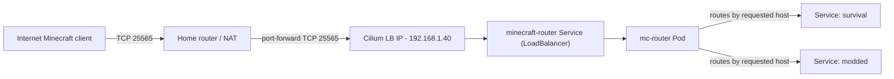
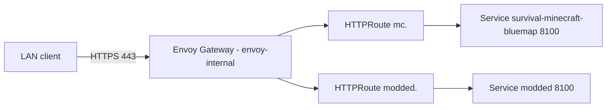

# Minecraft on Kubernetes (Talos + Flux + Cilium + Envoy Gateway)

This repo runs multiple Minecraft servers in the `minecraft` namespace using GitOps (Flux) and Cilium L2 LoadBalancers.

## High-level architecture

- **Game traffic (TCP 25565)**: handled by **`minecraft-router`** (`ghcr.io/itzg/mc-router`)
  - Exposed as a **Cilium `LoadBalancer`** on a fixed LAN IP
  - Routes players to backend servers based on the requested hostname (SRV / SNI-style routing)
- **Minecraft servers**:
  - **`survival`**: itzg Minecraft chart (`itzg/minecraft-server-charts`)
  - **`modded`**: deployed via `bjw-s/app-template` chart running `ghcr.io/itzg/minecraft-server`
- **Web UIs (BlueMap)**: exposed via **Gateway API `HTTPRoute`** through Envoy Gateway
  - Default in this repo: **internal-only** (uses `envoy-internal` in the `network` namespace)
- **Backups**: Volsync component is enabled for Minecraft apps (PVC + ReplicationSource/Destination pattern)
- **Secrets**: External Secrets Operator pulls from 1Password (no raw Secrets committed)

## Diagrams

### Game traffic (internet → LAN → mc-router → backends)



Notes:

- The cluster provides the **LAN entrypoint** (`192.168.1.40:25565`). Public access is achieved by **router port-forwarding**.
- The router API (8080) is **not required** for game traffic.

### Web UIs (BlueMap) (LAN → Envoy Gateway → HTTPRoute → service)



## Network / IPs

### Cilium LB IP pool

The cluster advertises `LoadBalancer` IPs on the LAN using Cilium L2:

- Cilium pool: `192.168.1.0/24` (see `kubernetes/apps/kube-system/cilium/app/networks.yaml`)

### Reserved IPs used by Minecraft

- **`minecraft-router`** (game entrypoint): `192.168.1.40`
- **`survival` RCON** (optional, LAN-only): `192.168.1.41`

Notes:

- These are allocated via Cilium LB IPAM annotations (`lbipam.cilium.io/ips`).
- “Free” in Kubernetes does not guarantee “free” on your LAN; keep these outside your router’s DHCP pool.

## DNS / hostnames

This repo avoids committing real domains. Hostnames use `${SECRET_DOMAIN}`, which is provided via Flux substitutions from `cluster-secrets`.

Examples:

- `minecraft-router` API: `minecraft-router.${SECRET_DOMAIN}` (internal HTTPRoute)
- `survival` BlueMap: `mc.${SECRET_DOMAIN}` (internal HTTPRoute)
- `modded` BlueMap: `modded.${SECRET_DOMAIN}` (internal HTTPRoute)

## Components in this directory

### `router/` (mc-router)

- Provides a **single stable IP** for game clients on port `25565`.
- Backend servers set `mc-router.itzg.me/externalServerName` so mc-router can route correctly.
- The router also exposes an **HTTP API + Prometheus metrics** on port `8080` (kept **internal-only** in this repo).
  - Upstream docs: [`itzg/mc-router`](https://github.com/itzg/mc-router)

### `survival/`

- Runs Paper (`TYPE: PAPER`) via the itzg chart.
- Exposes:
  - Game service (routed through `minecraft-router`)
  - BlueMap on port `8100` via an internal `HTTPRoute`
  - RCON via `LoadBalancer` (LAN only) using `192.168.1.41`

### `modded/`

- Runs a modded server (Paper + Modrinth projects) using `bjw-s/app-template`.
- Exposes:
  - Game service (routed through `minecraft-router`)
  - BlueMap on port `8100` via an internal route (as configured in the Helm values)

## Backups (Volsync)

Minecraft apps enable the shared Volsync component at the Flux `Kustomization` level.

At a high level:

- A PVC named `${APP}` is created with a `dataSourceRef` to a `ReplicationDestination`
- Volsync schedules and stores snapshots using Kopia (configured under `volsync-system/`)

Restore notes:

- Follow the repo restore scripts/runbooks (see `scripts/restore-volsync-populator.sh` and `docs/VOLSYNC_POPULATOR_RESTORE.md`).
git push
## Secrets (External Secrets Operator / 1Password)

Minecraft secrets are sourced from 1Password via External Secrets Operator (ESO).

### `survival` RCON secret

The `survival` server expects a Kubernetes Secret named `survival` containing:

- **`rcon-password`**: the RCON password used by the chart (`minecraftServer.rcon.existingSecret: survival`)

This Secret is created by `ExternalSecret/minecraft/survival` by reading the 1Password field:

- **`minecraft/RCON_PASSWORD`** (item/field path; adjust to your vault conventions)

If the 1Password key/field does not exist, ESO will not create `Secret/survival`, and the pod will fail with:

- **`CreateContainerConfigError`** / **`secret "survival" not found`**

## Operations

### Check status (cluster)

```bash
kubectl get pods -n minecraft
kubectl get svc -n minecraft
kubectl get httproute -n minecraft
```

### Flux reconcile (GitOps)

```bash
flux reconcile ks survival -n minecraft --with-source
flux reconcile ks modded -n minecraft --with-source
flux reconcile ks minecraft-router -n minecraft --with-source
```

### Troubleshooting tips

- If game traffic isn’t reaching a server:
  - Verify `minecraft-router` Service has the expected LB IP (`192.168.1.40`)
  - Verify each server sets `mc-router.itzg.me/externalServerName` to the expected hostname
- If BlueMap isn’t reachable:
  - Confirm the `HTTPRoute` parentRef uses `envoy-internal` and `namespace: network`
  - Check Envoy Gateway is healthy in the `network` namespace
